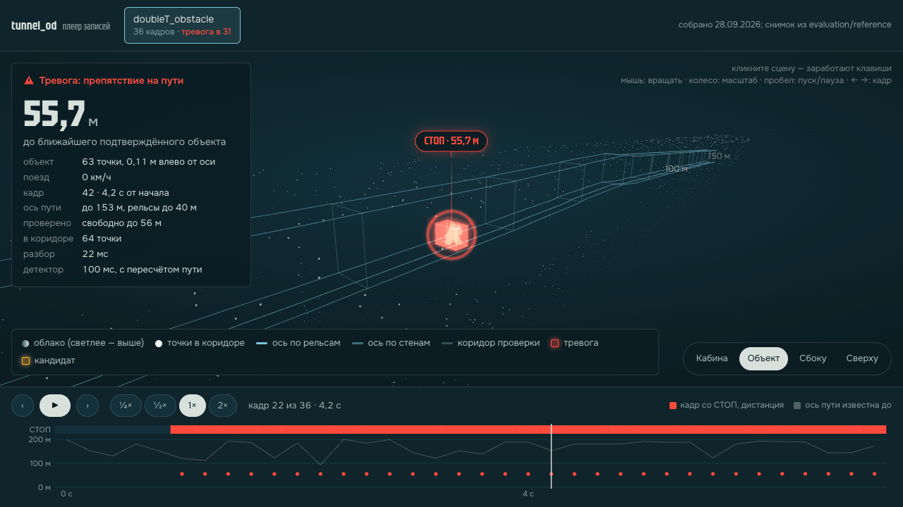

# Обнаружение препятствий в тоннеле метро по 3D-лидару

ROS 2-узел в каждом кадре 128-канального лидара решает, есть ли что-то на пути поезда и на каком расстоянии: СТОП / ВНИМАНИЕ / СВОБОДНО.



**Запуск в 3 команды** (Docker и Docker Compose; сеть нужна только при сборке):

```bash
docker compose build                           # 1. сборка образа
BAG=/путь/к/записи docker compose up play      # 2. узел + ros2 bag play на вашей записи (каталог с metadata.yaml)
ls output/                                     # 3. результат: <запись>_result.jsonl, _stats.json, _e2e.json
```

| Ключевая цифра | |
|---|---|
| Препятствия организаторов в габарите (`cloud_with_fake_obj`) | СТОП на **8 из 8**, на объектах вне габарита — **0** |
| Ложные СТОП на записях без препятствий | **2,0 %** кадров (исходная версия — 12,2 %) |
| Вставленные в реальные кадры препятствия | найдено **72 %** (было 58 %), медиана дальности **118 м** (было 99 м) |
| Человек на пути, подъезд со 170 м | подтверждён на **160 м** |
| Разбор кадра, C++ | **8 мс** на самом тяжёлом кадре (Python — 23 мс), результат побитово тот же |

Финальный прогон 29.09 по всем записям; подробности и оговорки — в разделе [«Результаты»](#результаты).

**Смотреть:** отчёт `output/report/index.html` и плеер `demo.html` (собирается `python -m evaluation all`, быстрая версия `--quick` — в `output/report_quick/`) · [ответы жюри](docs/qa_jury.md) · [сложные участки](docs/hard_cases.md) · [плеер, анимация](docs/img/demo.gif)

## Соответствие ТЗ

Каждое требование ТЗ и Q&A с постановщиком от 16.09 — и где это проверить. Копия — [docs/tz_compliance.md](docs/tz_compliance.md).

| Требование ТЗ | Статус | Доказательство | Ограничение |
|---|---|---|---|
| §3.2 Ubuntu 22.04, ROS 2 Humble, Docker | ✅ | `Dockerfile` (`ros:humble-ros-base-jammy`), `docker-compose.yml` | — |
| §3.3 Запуск в Docker → ROS 2 → чтение bag → обработка потока → вывод результата | ✅ | `docker compose up play` (`play.launch.py`): `ros2 bag play` + узлы | — |
| §3.3, §7.2 Зависимости ставятся при сборке, без ручных шагов | ✅ | `Dockerfile`; без Docker Hub — `--build-arg BASE_IMAGE`; для стенда без интернета — готовый образ `tunnel_od_image_2026-09-29.tar.gz` | сборка из исходников требует доступа к apt и pip |
| §2 Выход: есть препятствие / нет, расстояние до ближайшего | ✅ | `/tunnel_od/result`: `status`, `distance_m` на каждый кадр | — |
| §2 Дополнительно: положение, размеры, уверенность, тип | ◐ | `objects[]`: `position_m`, `size_m`, `confidence`; `tests/test_robustness.py::test_object_output_has_size_confidence_position` | тип объекта не определяется |
| Q&A 4.1 Габарит 2,1 × 3 м | ◐ | зона 0,15–3,0 м над головкой рельса, ±1,0 м от оси пути ∪ ±1,0 м от оси лидара ближе 40 м на прямой ([algorithm.md](docs/algorithm.md#зона-объекты-подтверждение-detection)) | ширина 2,0 м: ошибка оси 5–30 см; в дальней зоне верх 1,5 м |
| Q&A 4.1 Минимальный объект 300 × 300 × 100 мм | ◐ | куб 0,4 м и 0,2 м при подъезде ([experiments.md](docs/experiments.md#дальность)); нижняя граница зоны 0,15 м | плоский объект ниже 0,15 м над головкой рельса не виден |
| Q&A 4.5 Оборванные кабели в габарите | ◐ | подтверждение по устойчивому неподвижному треку: стержень со свода (объект 10) — СТОП с 22 м ([experiments.md](docs/experiments.md#эксперименты-282909-финальная-доводка)) | вдали предмет целиком выше 1,5 м над головкой рельса не ловится |
| §8.1 Обнаружение, пропуски, ложные срабатывания | ✅ | бэг организаторов: СТОП на 8 из 8 объектов в габарите, 0 вне габарита, 5 ложных СТОП-кадров из 1510; пустые записи — 2,0 % кадров СТОП (финальный прогон 29.09, `evaluation/reference/fake_obj_fo_final.csv`, `alarms_final.csv`) | реальное препятствие в данных одно, остальное — синтетика |
| §8.1 Работа на данных, не использованных при разработке | ✅ | `new_data` (18,8 мин) отложена и при подборе не использовалась: СТОП 3,3 % кадров на всей записи, 5,5 % на 8 отрезках против 14,6 % у исходной версии ([experiments.md](docs/experiments.md#ложные-тревоги)) | других тоннелей в открытых данных нет |
| §8.2 Дальность: 100 / 200 / 300 м | ◐ | подъезд к синтетическому объекту в реальных записях (`python -m evaluation approach`): найдено 72 % из 120 подъездов, медиана 118 м; человек со 170 м — 160 м, со 220 м — 187 м (в 50 % окон) | 300 м недостижимы: по нашим наблюдениям отражений дальше ~210 м нет; в кривой путь закрыт стеной |
| §8.3 Задержка, частота, CPU/GPU, реальное время | ✅ | замеры в [experiments.md](docs/experiments.md#скорость): узел p50 14–18 мс при бюджете 100 мс; разбор кадра C++ 8 мс на тяжёлом кадре, ~3 мс на остальных | на слабом CPU узел отбрасывает устаревшие кадры |
| §3.1 GPU на стенде | ✅ | только CPU, GPU не нужен | — |
| §8.4 Обобщаемость | ✅ | геометрия пути без обучения; автоопределение топика `PointCloud2`, QoS best_effort, `.mcap`, любой uid хоста, оси REP-103 через `input_axes` | новые типы тоннелей не проверены |
| Безопасность ответа | ✅ | «свободно» только при видимости пути от 30 м, иначе `unknown` (`min_sight_m`) | — |
| §4 Демонстрация: облако → детекция → расстояние, RViz2 | ✅ | `docker compose up demo`: RViz2 в браузере через noVNC; маркеры `/tunnel_od/markers`; офлайн-плеер `demo.html` | — |
| §5 README: описание, сборка, запуск, bag, параметры | ✅ | этот README, [`config/detector.yaml`](config/detector.yaml), [architecture.md](docs/architecture.md#параметры) | — |
| §5 Архитектура, алгоритм, эксперименты, сложные случаи | ✅ | [architecture.md](docs/architecture.md), [algorithm.md](docs/algorithm.md), [experiments.md](docs/experiments.md), [hard_cases.md](docs/hard_cases.md) | — |
| §5 Видео работы | ◐ | анимация плеера [docs/img/demo.gif](docs/img/demo.gif); отдельного видео в репозитории нет | — |
| §8.5 Тесты | ✅ | gtest (`tunnel_od_preproc`), pytest (`tests/`, узел); `docker compose run --rm test` | — |
| §8.6 docker build → docker run → ros2 bag play → результат | ✅ | запуск в 3 команды выше; вариант голым `docker run` — в разделе «Без Compose» | — |
| §8.7 Подход команды | ✅ | [«Подход команды»](docs/experiments.md#подход-команды), [эксперименты 28–29.09](docs/experiments.md#эксперименты-282909-финальная-доводка) | — |
| Q&A 4.6 Работа офлайн, без внешних API | ✅ | сеть нужна только при сборке; отчёт открывается без сети | — |
| Q&A 4.4, 4.9 Гермозатвор, стрелки, платформа, лужи, знаки | ◐ | [hard_cases.md](docs/hard_cases.md) | проезд на отклоняющийся путь и зеркальные отражения луж не проверены |

## О решении

Система отвечает беспилотному поезду на вопрос **«есть ли на пути что-то, чего там быть не должно, и на каком расстоянии»**. На вход — поток облаков точек 128-канального лидара (ROS 2, `sensor_msgs/PointCloud2`), на выходе для каждого кадра — решение СТОП / ВНИМАНИЕ / СВОБОДНО или «путь не определён», дистанция до ближайшего препятствия, докуда путь проверен свободным, и список найденных объектов.

Подход геометрический, без обучения. Детектор в каждом кадре находит рельсы своего пути и ведёт ось пути — по рельсам вблизи, по стенам тоннеля дальше, до 150–200 м. Затем он ищет точки в коридоре над рельсами, собирает их в объекты, отсеивает продольные конструкции (кабели, контактный рельс, стену в кривой) и копит свидетельство по каждому объекту между кадрами с учётом движения поезда. Поэтому метод не зависит от того, как выглядит препятствие, и не требует размеченных данных.

**Габарит** — зона проверки над своим путём: 0,15–3,0 м над головкой рельса (высота по ТЗ — 3 м) и ±1,0 м по ширине, то есть 2,0 м вместо 2,1 м по ТЗ. Ширина уже, потому что ось пути вдали мы оцениваем с ошибкой 5–30 см: при ±1,05 м детектор даёт СТОП на объекте бэга организаторов, стоящем вне габарита. Ближе 40 м на прямой зона считается и от оси пути, и от оси лидара: организаторы ставят объекты от оси лидара. В дальней зоне, где ось и полотно — оценка, верх зоны 1,5 м. Подробно — в [docs/algorithm.md](docs/algorithm.md#зона-объекты-подтверждение-detection).

Как мы пришли к этому решению, от исходной версии через варианты A→P, — в разделе [«Подход команды»](docs/experiments.md#подход-команды). Как детектор ведёт себя на лужах, гермозатворе, стрелках, платформах и засветах — в [docs/hard_cases.md](docs/hard_cases.md).

## Результаты

Финальный прогон 29.09 (`python -m evaluation all`, итоговая конфигурация, все записи целиком). Копии результатов — `evaluation/reference/*_final*`.

| | Итог | Было |
|---|---|---|
| Бэг организаторов `cloud_with_fake_obj`: СТОП на объектах в габарите | **8 из 8** | 5 из 8 (до доводки 28–29.09) |
| Бэг организаторов: СТОП на объектах вне габарита (5, 7) | **нет** | нет |
| Бэг организаторов: первый СТОП, м | 1: **98** · 2: 44 · 3: 48 · 4: 33 · 6: **186** · 8: 54 · 9: **100** · 10: 22 | — |
| Пустые записи (5 записей, 2287 кадров): ложные СТОП | **2,0 %** кадров (46) | 12,2 % (278), исходная версия |
| Вставки препятствий в реальные кадры, 120 подъездов | найдено **72 %** (87), медиана дальности **118 м** | 58 % (70), 99 м |
| Человек на пути, подъезд со 170 м / 220 м | **160 м** / 187 м | 116 м / не найден |
| Отложенная `new_data`, 8 отрезков по 400 кадров: СТОП | **5,5 %** кадров ([CSV](evaluation/reference/alarms_nd_final.csv)) | 14,6 % |
| Вся `new_data` (11 271 кадр, 18,8 мин): СТОП | **3,3 %** кадров | — |
| Реальный предмет на рельсе, 56 м (`doubleT_obstacle`) | СТОП в **191 из 201** кадра | 49 |
| Разбор кадра C++ / Python | **8,0 / 23,0 мс** на тяжёлом кадре, ~3 / 7,5 мс на остальных; побитовое совпадение на 210 из 210 кадров ([JSON](evaluation/reference/check_preproc_final.json)) | — |
| Ошибка дистанции | медиана 3 см, 95 % — до 1 м | — |
| Docker | `build`, `test` (gtest 15, pytest 21 — все прошли), `play` без ошибок ([test](evaluation/reference/docker/final_test.log), [play](evaluation/reference/docker/final_play.log)); у всех объектов есть `size_m`, `confidence`, `position_m` | — |

«Было» — исходная версия детектора (`ae38df6`); для бэга организаторов — версия 27.09 с зоной 2,5 м (`evaluation/reference/fake_obj_fo_base.csv`).

<details>
<summary>Оговорки</summary>

- Реальное препятствие в данных одно; объекты организаторов и вставки при подъезде — синтетика.
- Ложных СТОП-кадров на бэге организаторов 5 из 1510 против 4 до доводки: плата за подтверждение стержня со свода (объект 10) по устойчивому треку.
- ВНИМАНИЕ (объект у края или вдали, поезд не тормозит) — 27,3 % кадров пустых записей и 31,5 % `new_data`.
- 300 м на этом сенсоре недостижимы: отражений дальше ~210 м в записях нет. Со 220 м человек находится в половине окон.
- Задержка узла в Docker — замер 28.09 в [docs/experiments.md](docs/experiments.md#скорость).

</details>

Подробно, с методикой и историей вариантов — [docs/experiments.md](docs/experiments.md).

## Запуск

Нужны Docker и Docker Compose. Все зависимости ставятся при сборке, при запуске сеть не нужна.

```bash
docker compose build
BAG=/путь/к/записи docker compose up play     # узел + ros2 bag play; итог в output/
BAG=/путь/к/записи docker compose up demo     # то же по кругу + RViz в браузере: http://localhost:6080
```

- `BAG` — каталог записи ros2 bag, в котором лежит `metadata.yaml`. Поддерживаются `.db3` и `.mcap`. Без `BAG` берётся `./data/cloud_with_fake_obj`; если такого каталога нет, `BAG` обязателен (compose остановится с ошибкой, а не смонтирует пустой каталог).
- Топик облака определяется сам: берётся единственный `PointCloud2` в записи, с любым именем, а если облаков несколько — `/lidar_points`. Другой топик: `TOPIC=/имя docker compose up play` (в launch — `topic:=`). Запись с QoS best_effort проигрывается как reliable, живой лидар с best_effort подхватывается автоматически.
- Оси облака без полей контракта считаются как в записях организаторов. Для облака с осью X вперёд (REP-103) — `input_axes:=rep103` (`detector.launch.py`) или `input_axes: rep103` в `config/detector.yaml`.
- Только CPU, GPU не нужен; загрузка CPU и памяти — в [docs/experiments.md](docs/experiments.md#скорость).
- `docker compose stop` останавливает контейнер сигналом SIGINT примерно за 5 с; итог `<запись>_stats.json` при этом записывается.
- `output/` пишется от имени владельца каталога на хосте: UID/GID задавать не нужно.
- Переменные окружения:

| Переменная | По умолчанию | Смысл |
|---|---|---|
| `RATE` | `1.0` | скорость проигрывания записи |
| `REFIT_MODE` | из `config/detector.yaml` | `sync` — пересчёт пути синхронно, результат детерминирован |
| `MAX_PENDING` | из `config/detector.yaml` | очередь кадров узла; большое значение — кадры не отбрасываются |
| `TOPIC` | автопоиск | топик `PointCloud2` в записи или у лидара |
| `CPUS` | без ограничения | лимит ядер для `demo` |

Детерминированная оценка, без потери кадров:

```bash
REFIT_MODE=sync MAX_PENDING=100000 RATE=0.5 BAG=/путь/к/записи docker compose up play
```

После `play` в `output/` лежат результат каждого кадра (`<запись>_result.jsonl`, то же, что публикуется в `/tunnel_od/result`), итог прогона с задержками (`<запись>_stats.json`) и e2e-замер (`<запись>_e2e.json`). В логе узла — строка `СТОП кадр …` на каждый кадр со СТОП и `ИТОГ {...}` в конце.

Другие режимы:

```bash
docker compose up detector            # только узлы — для живого лидара или своего плеера
docker compose run --rm test          # тесты: gtest (C++) и pytest (узел)
```

### Если Docker Hub недоступен (403 / timeout)

Сборка падает на `FROM ros:humble-ros-base-jammy`. Базовый образ берётся с зеркала Google, остальное (apt: `packages.ros.org`, `archive.ubuntu.com`; pip: `pypi.org`) Docker Hub не требует.

```bash
# вариант 1, для compose: заранее положить базовый образ под штатным именем
docker pull mirror.gcr.io/library/ros:humble-ros-base-jammy
docker tag mirror.gcr.io/library/ros:humble-ros-base-jammy ros:humble-ros-base-jammy
docker compose build

# вариант 2, для голого docker build: указать базовый образ аргументом
docker build --build-arg BASE_IMAGE=mirror.gcr.io/library/ros:humble-ros-base-jammy --target detector -t tunnel_od .
```

Если недоступен и `pypi.org`, добавьте к `docker build` `--build-arg PIP_INDEX_URL=https://<зеркало>/simple`.

### Готовый образ без сборки

```bash
docker load -i tunnel_od_image_2026-09-29.tar.gz   # образы tunnel-od и tunnel-od-viz, архив 412 МБ
BAG=/путь/к/записи docker compose up play     # образ уже есть, compose его не пересобирает
```

Не запускайте после загрузки `docker compose build` и `up --build`: они пересоберут образ из исходников.

### Без Compose

То же, что `docker compose up play`, голым Docker. Сборка — стадия `detector` (последняя стадия Dockerfile, `viz`, добавляет RViz для `demo`):

```bash
docker build --target detector -t tunnel_od .
mkdir -p output
docker run --rm --shm-size 2g \
  -v "$PWD/config:/opt/tunnel_od/config:ro" \
  -v "$PWD/output:/out" \
  -v "/путь/к/записи:/bag:ro" \
  tunnel_od ros2 launch tunnel_od_detector play.launch.py bag:=/bag rate:=1.0
```

Для детерминированной оценки добавьте `-e TUNNEL_OD_REFIT_MODE=sync -e TUNNEL_OD_MAX_PENDING=100000` и `rate:=0.5`. `output/` нужно создать заранее: иначе Docker создаст его от root.

Параметры алгоритма и узлов — в [`config/detector.yaml`](config/detector.yaml), их описание — в [docs/architecture.md](docs/architecture.md#параметры). Каталог монтируется в контейнер, после правки пересобирать образ не нужно.

## Результат в ROS 2

| Топик | Тип | Что внутри |
|---|---|---|
| `/tunnel_od/result` | `std_msgs/String` | JSON на кадр: `status` (`stop` / `caution` / `clear` / `unknown`), `distance_m`, `caution_distance_m`, `clear_to_m`, `objects`, `path_range_m`, `speed_mps`, `latency_ms`, … |
| `/tunnel_od/markers` | `visualization_msgs/MarkerArray` | ось пути, коридор, объекты, текст решения — для RViz |
| `/tunnel_od/input_diagnostics` | `diagnostic_msgs/DiagnosticArray` | проверка входного потока |

## Устройство

```
core/            алгоритм: пакет Python tunnel_od (numpy, без ROS)
ros2_ws/src/     tunnel_od_preproc — приём облака (C++), tunnel_od_detector — узел и launch-файлы
config/          параметры, транспорт DDS, вид RViz
evaluation/      оценка качества офлайн: python -m evaluation
tests/           тесты ядра
docs/            архитектура, алгоритм, эксперименты, формат входа
```

```
ros2 bag play ─▶ tunnel_od_preproc (C++) ─▶ tunnel_od_detector (Python, ядро tunnel_od) ─▶ /tunnel_od/result
                                                                                        └▶ /tunnel_od/markers ─▶ RViz2
```

| Документ | О чём |
|---|---|
| [docs/architecture.md](docs/architecture.md) | компоненты, топики, поля результата, запуск, DDS и большие кадры |
| [docs/algorithm.md](docs/algorithm.md) | как устроен детектор: ось пути, полотно, зона, накопление; параметры и ограничения |
| [docs/experiments.md](docs/experiments.md) | дальность, ложные тревоги, скорость, [подход команды](docs/experiments.md#подход-команды) и варианты A→P, что не сработало |
| [docs/hard_cases.md](docs/hard_cases.md) | сложные участки: лужи, гермозатвор, стрелка, платформа, засветы, кривые — что работает и что остаётся ограничением |
| [docs/input_format.md](docs/input_format.md) | требования к облаку лидара и что принимает узел приёма |

## Оценка качества без Docker

На любой ОС с Python 3.10+, по записям в `data/` (или `--data <каталог>`):

```bash
pip install -e "core[eval]"
python -m evaluation all --quick      # проверка окружения, пара минут
python -m evaluation all              # всё: ложные тревоги, дальность, скорость; ~20–60 мин
```

Отчёт — одна страница `output/report/index.html` и 3D-плеер `demo.html` рядом с ней (после `--quick` — в `output/report_quick/`). Открывается в браузере без сети. Список команд — `python -m evaluation --help`.

## Ограничения

- Реальное препятствие в данных одно; дальность измерена на синтетических объектах, вставленных в реальные кадры лучами датчика.
- Объекты у края габарита (1,0–1,15 м от оси) получают только ВНИМАНИЕ; плоские предметы ниже 0,15 м над рельсом не обнаруживаются. В дальней зоне верх зоны 1,5 м: предмет целиком выше (кабель со свода) даёт тревогу только вблизи — стержень со свода организаторов получает СТОП с 22 м.
- В кривой путь дальше 60–120 м закрыт стеной — объект там физически не виден.
- Пока поезд почти стоит, дальний объект может временно теряться.

Подробнее — в [docs/algorithm.md](docs/algorithm.md#ограничения).
