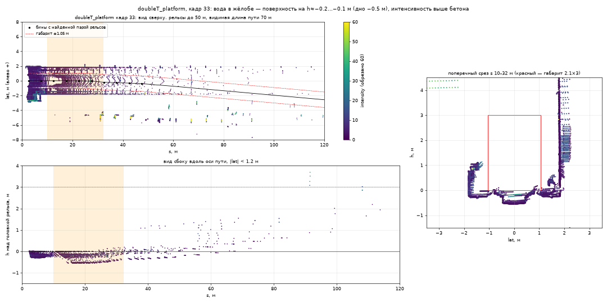
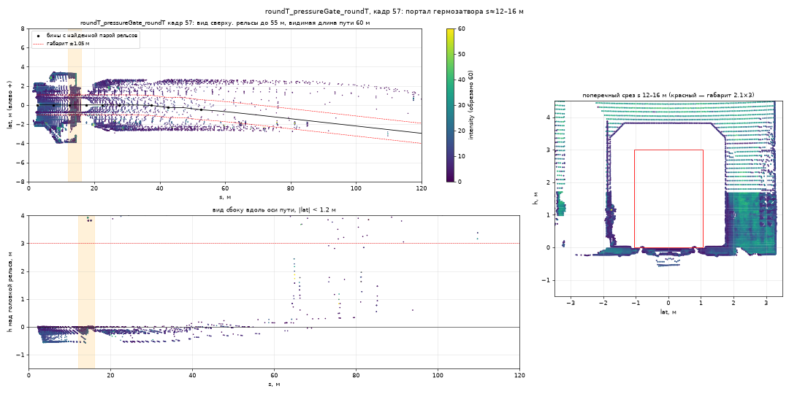
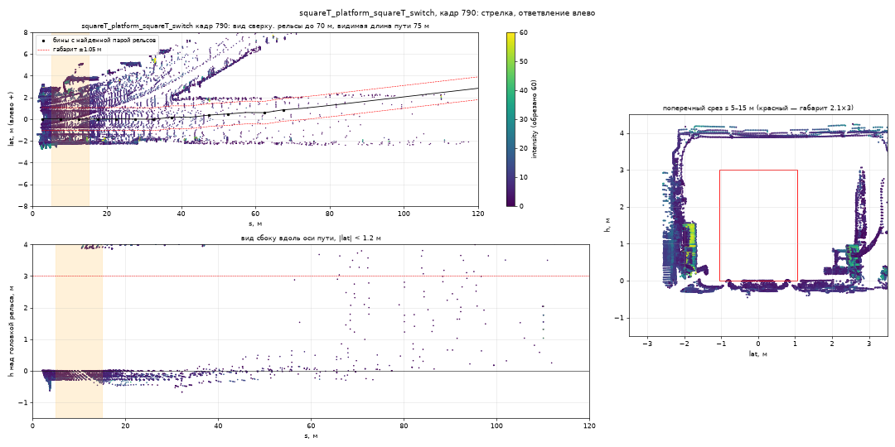
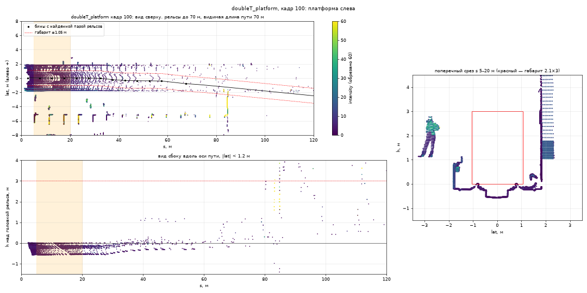
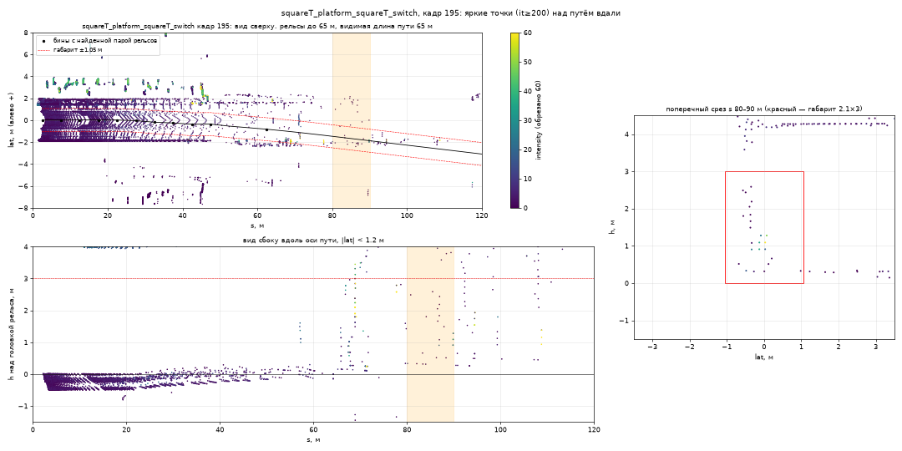
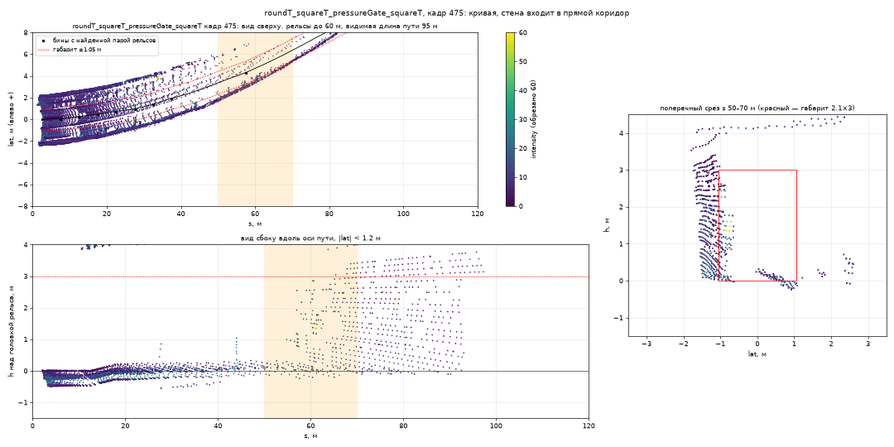

# Сложные участки

Какие места тоннеля мешают детектору и чем он с ними справляется. Наблюдения взяты из разведки данных (22.09, шесть записей `for_hackathon`), механизмы описаны в [algorithm.md](algorithm.md), цифры качества — в [experiments.md](experiments.md).

Графики построены инструментами разведки, а не детектором: ось на них — от трекера разведки, красная рамка — габарит ТЗ ±1,05 × 3 м. `s` — дальность вдоль пути, `lat` — смещение от оси, `h` — высота над головкой рельса.

## Сводка

| Участок | Чем опасен | Что работает (модуль) | Статус |
|---|---|---|---|
| Лужи в жёлобе | ложная тревога от «поднявшегося пола» или зеркальных точек | нижняя граница зоны над головкой рельса (`detection/zone.py`), полотно по 10-му перцентилю (`geometry/bed.py`) | обработан; зеркальные фантомы — ограничение |
| Гермозатвор | потеря рельсов на пороге, портал сбивает ось по стенам | прослеживание рельса через разрыв (`geometry/rails.py`), допуск по стене (`geometry/path.py`) | обработан |
| Стрелка | ось уходит на чужую пару, остряки у нижней границы зоны | затравка у лидара и прослеживание (`geometry/rails.py`), `clearance` 0,15 м | обработан; отклоняющийся путь не проверен |
| Платформа, контактный рельс, конструкции у края | край в коридоре при ошибке оси, стоянка поезда | ширина зоны ±1,0 м, `mark_edge_lines` (`detection/clustering.py`), `EgoMotion` | обработан частично |
| Засветы: знаки, отражатели | единичные яркие точки над путём вдали | интенсивность не используется; порог точек, накопление, граница оси, `plausibility.py` | обработан; вдали верх зоны 1,5 м |
| Частичные отражения (dual return) | 4–21 точка на кадр в коридоре на 36–77 м | порог точек и накопление (`detection/tracking.py`) | обработан косвенно |
| Кривые | стена входит в «прямой» коридор — главный источник ложных точек | ось по стенам по параболе (`geometry/path.py`), `edge_lines`, `plausibility.py`, `sight_m` | обработан; дальше хорды видимости — ограничение |

Главный вывод разведки: ложные точки в коридоре пустых записей дают в основном ошибки оси и высоты пути на 35–80 м, а не лужи и знаки. Поэтому основная работа ушла в модель пути, а фильтров «под помеху» в детекторе нет.

## Лужи в жёлобе

**В данных.** Полотно на оси пути лежит на −0,23…−0,25 м от головки рельса, дно жёлоба — на −0,47…−0,55 м. В `doubleT_platform` (широкий жёлоб у платформы) есть ещё уровни −0,17 м (8 % точек) и −0,05 м (4,5 %): вода или настил. Интенсивность воды ~20–30 против ~5 у бетона. Зеркальных точек ниже дна жёлоба практически нет: по оси (|lat| < 0,3 м, s < 80 м) — от 0 до 25 точек на всю запись (каждый 5-й кадр).

**Чем опасно.** Приподнятая поверхность воды похожа на предмет на полотне. Зеркальное отражение («фантом» под полотном или над водой) — возможная ложная тревога. Заказчик упоминал «характерный артефакт» луж: на скрытых данных он может быть сильнее.

**Как обрабатывается.**
- Зона начинается на 0,15 м выше головки рельса (`clearance`, `detection/zone.py`). Вода всегда ниже головки (h < 0), и в зону не попадает по построению. Зеркальные точки под полотном — тоже.
- Вблизи (до 38–40 м) головка рельса берётся по самим рельсам (`geometry/bed.py::rail_top_at`), поэтому поднятая водой поверхность на зону не влияет.
- Дальше головка — это дно лотка плюс `rail_offset`. Дно — 10-й перцентиль высоты в полосе ±0,5 м, и бин принимается, только если продолжает профиль с уклоном до 6 % (`estimate_bed_profile`). Лужа, не закрывающая жёлоб целиком, дно не поднимает.

**Ограничения.** Отражения «вверх» (фантом над водой) в открытых данных не найдены, отдельного фильтра для них нет. Такой фантом поймают только общие механизмы: порог точек, накопление, ЭГО-тест. `rail_offset` измеряется на 5–25 м (медиана, сглаживание 0,3 за пересчёт пути). Как на него влияет лужа во весь жёлоб на этом участке, не проверено.

## Гермозатвор

**В данных.** Гермозатвор есть в двух записях (`roundT_pressureGate_roundT`, `roundT_squareT_pressureGate_squareT`). Рельсы «заподлицо» только на пороге длиной ~0,5–1 м вдоль пути, до и после него они выступают как обычно. Порог виден с ~35 м. Портал сужает сечение до прямоугольника ~3,6–4 × 3,8–4,2 м (в круглом тоннеле ~5 м), сбоку ниша с полом на уровне головки.

**Чем опасно.** На пороге рельсы пропадают — трекер может потерять ось. Портал резко приближает стены: ось, продлённая по стенам, может съехать, и стена портала окажется в коридоре — ложная тревога.

**Как обрабатывается.**
- Рельс прослеживается через разрыв до 8 м без пика (`TRACE_MAX_GAP`, `geometry/rails.py`) — порог в 0,5–1 м его не рвёт.
- Портал ближе ~40 м попадает на участок, где ось задают рельсы, а не стены.
- Дальше ось ведётся по стенам (`geometry/path.py`): расстояние до стены должно совпадать с измеренным вблизи с допуском 0,3 м (`WALL_TOL`). Скачок расстояния на сужении засчитывается как промах, после трёх промахов подряд (`WALL_MAX_MISSES`) пошаговое продление останавливается. Точки ближе 1,1 м к оси (`WALL_MIN_LAT`) в поиск стены не входят.
- Стены портала на графике — примерно в 1,8 м от оси, за зоной ±1,0 м; перемычка — около 3,8 м над головкой, выше зоны 3,0 м. То, что всё же заденет край коридора при ошибке оси, собирает в цепочки `mark_edge_lines`.

**Статус.** Ось не теряется: кадров без оси — 0 на всех записях, в том числе с гермозатвором. Статус `unknown` в финальном прогоне 29.09 — 0,5 % кадров пустых записей и 0,9 % `new_data`, и все они — по правилу безопасности «путь виден ближе 30 м» (`min_sight_m`), а не из-за потери оси. На двух записях с гермозатвором СТОП получают 0,7 % и 1,1 % кадров ([experiments.md](experiments.md#ложные-тревоги)). Отдельного замера ложных тревог именно в кадрах гермозатвора нет.

## Стрелка

**В данных.** В `squareT_platform_squareT_switch` ответвление влево видно с кадров ~750–770 на 30–50 м. В кадрах ~774–812 стрелочный перевод проходит под лидаром. В кадрах 810–830 отклоняющиеся рельсы идут на 1–4,5 м вбок. Рельсы ответвления лежат на уровне головки, точки остряков и крестовины — на 0–0,1 м.

**Чем опасно.** Трекер может выбрать пару «свой рельс + рельс ответвления», и ось уйдёт в сторону. Остряки и крестовина близко к нижней границе зоны.

**Как обрабатывается.**
- Пара рельсов ищется затравкой ближе 10 м, с колеёй 1,45–1,75 м и серединой не дальше 0,4 м от лидара: поезд стоит на своём пути (`geometry/rails.py`). Дальше каждый рельс ведётся срез за срезом с допуском 12 см к предсказанию (`TRACE_TOL`). Ответвление уходит вбок быстрее и не подхватывается. Раньше, при склейке пиков по всему участку, на стрелках выбиралась чужая пара — прослеживание от затравки это убрало.
- Ответвление и крестовина лежат ниже `clearance` = 0,15 м над головкой рельса и в зону не входят.

**Ограничение.** В данных поезд идёт по прямому пути. Проезд на отклоняющийся путь не проверен.

## Платформа, контактный рельс, конструкции у края

**В данных.** Платформа — площадка на 1,06–1,11 м над головкой, край в 1,77–2,16 м от оси (`doubleT_platform` — слева 1,79 м, `squareT_…_switch` — справа 1,86 м): в 0,7–0,8 м за габаритом, люди на платформе — вне коридора. Контактный рельс с кожухом — слева на 1,3–1,5 м, 0,2–0,35 м над головкой: ~0,25 м за габаритом. На входе в сдвоенный тоннель (`roundT_doubleT`, кадр 125) вертикальная конструкция стоит на 1,0–1,1 м от оси до высоты 2,3 м — на самой границе. У платформ поезд стоит десятки секунд.

**Чем опасно.** При ошибке оси больше ~0,2 м контактный рельс или конструкции у края входят в коридор — ложная тревога. Неподвижную конструкцию нельзя отличить от препятствия по движению: обе приближаются со скоростью поезда.

**Как обрабатывается.**
- Ширина зоны ±1,0 м, а не ±1,05 м по ТЗ: ошибка оси 5–30 см, и более широкая зона даёт СТОП за габаритом (объект 5 бэга организаторов, [experiments.md](experiments.md#объекты-организаторов-cloud_with_fake_obj)).
- `mark_edge_lines` (`detection/clustering.py`) собирает объекты у края (от 0,45 м) в цепочки. Цепочка длиннее 8 м — край платформы, кабель или контактный рельс, и тревоги она не поднимает.
- `EgoMotion` (`geometry/ego_motion.py`) сравнивает развёртку тоннеля с кадром 5 кадров назад, а не с соседним: на малой скорости сдвиг за кадр меньше ячейки. ЭГО-тест на стоящем поезде решения не выносит. На стоящем поезде в `doubleT_obstacle` СТОП держится в 191 кадре из 201.

**Статус.** На пустой `doubleT_platform` в финальном прогоне 29.09 СТОП получают 26 кадров из 345 (7,5 %), ВНИМАНИЕ — 33,6 % (`evaluation/reference/alarms_final.csv`). Это самая «шумная» из пустых записей: в среднем по пяти записям СТОП — 2,0 % кадров ([experiments.md](experiments.md#ложные-тревоги)).

**Ограничения.** Объект у самого края габарита (1,0–1,05 м от оси) получает только ВНИМАНИЕ. При скорости 1–3 м/с (подход к платформе) детектор терял объект на 87–93 м на 3,5 с: прогноз накопления рассчитан на движение ([algorithm.md](algorithm.md#ограничения)).

## Засветы: знаки и отражатели

**В данных.** Точек с интенсивностью ≥ 200 — 10–110 на кадр, больше всего на станциях. 90–97 % из них на стенах: таблички, знаки, отражатели, отделка платформы. В коридоре — в среднем 0,1–0,9 точки на кадр, максимум 12, и всегда далеко: 45–178 м, ни одной ближе 45 м. На полотне у оси яркие точки есть только в двух кадрах — вода или настил. Пример: `squareT_…_switch`, кадр 195, яркие точки над путём на ~85 м, h ≈ 2,5 м.

**Чем опасно.** Яркие точки в коридоре — ложная тревога, если ось вдали ошиблась. Фильтр по интенсивности внутри коридора опасен: световозвращающий жилет на человеке тоже яркий.

**Как обрабатывается.**
- Детектор интенсивность не использует вовсе: `parse_pointcloud2` (`pointcloud.py`) отдаёт только `x, y, z`. Яркая точка — такая же точка, решает геометрия. Знаки на стенах за ±1,0 м в зону не попадают.
- Единичные точки вдали не проходят порог минимума точек `max(3, 12000/d²)` и накопление свидетельства (`detection/tracking.py`). Тревога поднимается только до конца известной оси, за ним — ВНИМАНИЕ (`beyond_path`). Дальше 60 м объект с точками позади на его высоте получает ВНИМАНИЕ (`surface_behind`, `detection/plausibility.py`).

- В дальней зоне объект целиком выше 1,5 м над рельсом (`far_top`) тревогу не поднимает — как точки в примере выше (h ≈ 2,5 м на 85 м). Высота 3,0 м на всей дальности давала на бэге организаторов 20 ложных СТОП-кадров из 1510 против 4 ([experiments.md](experiments.md#эксперименты-282909-финальная-доводка)).

## Частичные отражения (dual return)

**В данных.** В 1,4–3,3 % пар столбцов две отдачи различаются, вторая всегда ближе. В коридоре на пустых записях — 4–21 такая точка на кадр, почти все на 36–77 м: кромки конструкций, провода и кабели под сводом.

**Как обрабатывается.** Вторая отдача удаляется, только если совпадает с первой до 1 см (`pointcloud.py`), различающиеся остаются: они же дадут точки тонкого оборванного кабеля. Шум отсекают порог минимума точек (7,5 точки на 40 м) и накопление свидетельства. Отдельного замера вклада вторых отдач в ложные тревоги нет.

## Кривые — главный источник ложных точек

**В данных.** Рельсы видны до 38–40 м, дальше ось приходится продлевать. Если продлевать её прямой, в кривой она недокручивается, и стена у внутренней стороны входит в коридор: сотни точек на 50–90 м, в затяжной кривой `roundT_squareT_…` (кадры 335–540) — до 1025 точек на кадр.

**Как обрабатывается.**
- Ось дальше рельсов ведётся по стенам с прогнозом шага по параболе, опорная точка ставится туда, где стену задел залп (`geometry/path.py`). На синтетической дуге R = 300–800 м ошибка оси на 80–160 м упала с 0,3–0,76 м до 0,02–0,04 м.
- В дальней зоне в цепочки `edge_lines` идут объекты с любым смещением, а одиночный объект длиннее 5 м считается конструкцией.
- `sight_m` в кривой ограничен хордой прямой видимости √(8·R·1,5 м).

**Ограничение.** В кривой путь дальше 60–120 м закрыт внутренней стеной: объект на пути физически не виден.
